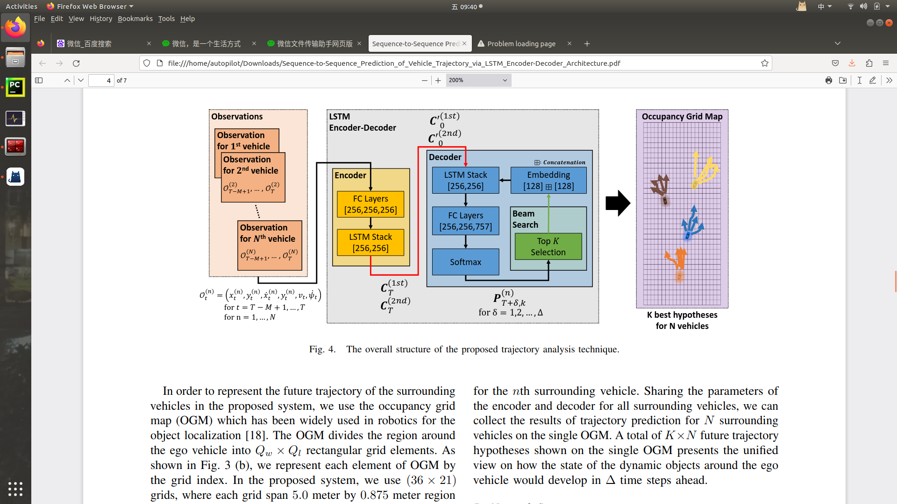

# 此处是正式工程

---
# 01
## 离线程序
## 输入：包括当前点在内的历史9个点的数据，目前只对x方向的轨迹进行预测，[x0, x1, ......, x8]，其中x8为当前位置，x7为上一时刻位置，x6为上上时刻位置，以此类推。暂不考虑时间的影响
## 输出：下一时刻的x方向坐标，[x9]

---
# 02
## 离线程序
## 输入：包括当前点在内的历史9个点的数据，目前只对x方向的轨迹进行预测，[x0, x1, ......, x8]，其中x8为当前位置，x7为上一时刻位置，x6为上上时刻位置，以此类推。暂不考虑时间的影响
## 输出：下3个时刻的x方向坐标，[x9, x10, x11]

---
# 03
## 输入：包括当前点在内的历史9个点的数据，以及各个点的速度值，目前只对x方向的轨迹进行预测，[x0, x1, ......, x8, v0, v1, ......, v8]。暂不考虑时间的影响
## 输出：下1个时刻的x方向坐标，[x9]

---
# 04
## 训练：
### 输入：[x0, x1, ......, x8]，暂不考虑时间的影响
### 输出：[x9]
## 测试：
### 1、输入[x0, x1, ......, x8]，得到[x9]
### 2、输入[x1, x2, ......, x9]，得到[x10]
### 3、输入[x2, x3, ......, x10]，得到[x11]

---
# 05
## 输入：[x0, x1-x0, x2-x0, x3-x0, ......, x8-x0]
## 输出：[x9]

---
# 06
## 输入：[x0, x1-x0, x2-x0, x3-x0, ......, x8-x0] -> [0, x1-x0, x2-x0, x3-x0, ......, x8-x0]
## 输出：[x9]
## lr和optim调整方式：k

---
# 07
## 参考了论文Sequence-to-Sequence_Prediction_of_Vehicle_Trajectory_via_LSTM_Encoder-Decoder_Architecture
## 只对环境中的某一辆车做二维预测
## 
## 50 预测 1
## 我真做不出来，换篇论文复现了

--
# 08
## 参考了论文[Vehicle_Trajectory_Prediction_Using_LSTMs_With_SpatialTemporal_Attention_Mechanisms.pdf](08%2FVehicle_Trajectory_Prediction_Using_LSTMs_With_SpatialTemporal_Attention_Mechanisms.pdf)
